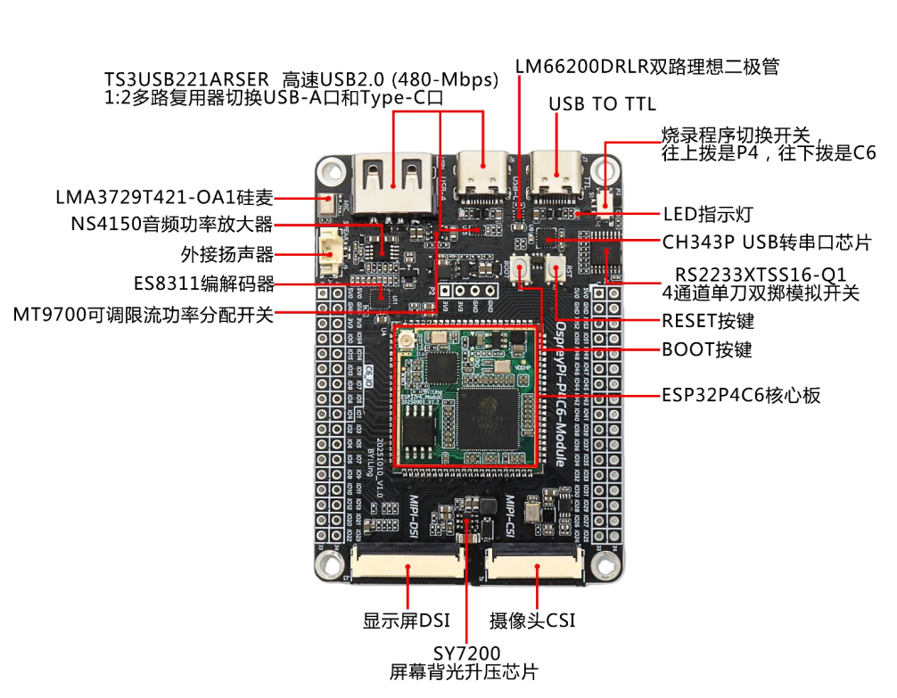
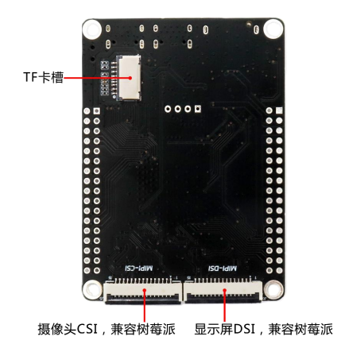
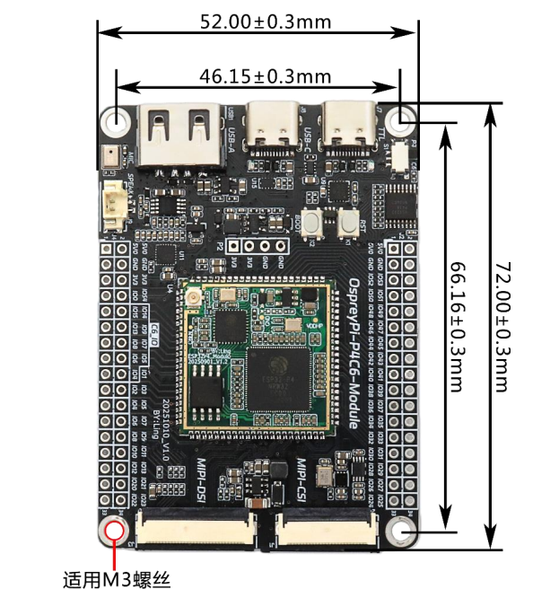
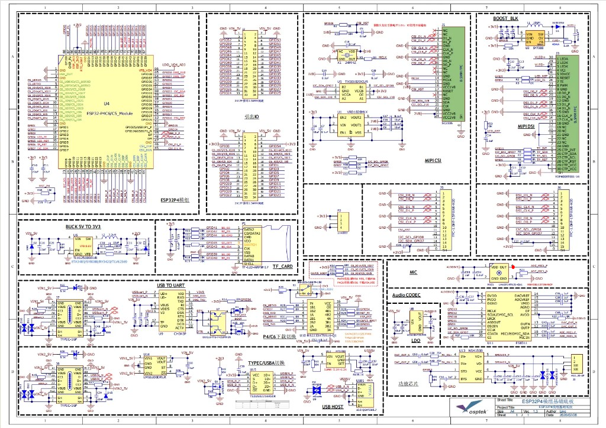

<p align="left"></p>

<h1 align="center">OSPTEK ESP32-P4C6-Module Dev Board</h1>

<p align="center"><b>Ready to Use · Rich Expansion · Full I/O Breakout</b></p>

<p align="center">English | <a href="./README.md">简体中文</a></p>

<p align="center">
  
  
  
  
  
</p>

<p align="center"></p>

## Contents

- [Overview](#overview)
- [Features](#features)
- [Applications](#applications)
- [Specifications](#specifications)
- [Hardware Resources](#hardware-resources)
- [Core Board](#core-board)
- [Compatible Displays](#compatible-displays)
- [Compatible Cameras](#compatible-cameras)
- [Get Started](#get-started)
- [Repository Structure](#repository-structure)
- [Documentation](#documentation)
- [Where to Buy](#where-to-buy)
- [Support](#support)

---

## Overview

The OSPTEK ESP32-P4C6-Module Dev Board is a multi-function development platform built around the
**ESP32-P4C6 core board**. The carrier adds camera, display, audio, USB and power-protection circuits,
and breaks out ESP32-P4's 55 programmable GPIOs plus ESP32-C6 GPIOs via 2×2×17 headers—ready for
evaluation and secondary development without designing your own carrier.

The onboard ESP32-P4 integrates two high-performance (HP) RISC-V cores and one low-power (LP) core,
up to 360 MHz, with JPEG codec, PPA, ISP and H.264 video encoder. Wireless connectivity is provided
by **ESP32-C6FH4** (onboard IPEX-1 antenna connector on the core board).

> 📌 Specifications below are based on the **ESP32-P4 chip revision v1.3**. Carrier I/O is isomorphic
> with the P4C5-Module Dev Board (compatible stamp-hole core boards).

---

## Features

- 🚀 **Ready to Use**: core board + carrier in one; power up and start evaluating
- ⚡ **High-Performance Dual-Core**: ESP32-P4 dual-core RISC-V up to 360 MHz, 16 MB Flash + 32 MB PSRAM
- 🎨 **Rich Multimedia**: JPEG codec, H.264 encoding, PPA, ISP for image & video
- 📶 **Wireless Connectivity**: onboard ESP32-C6FH4 with IPEX-1 antenna connector
- 📷 **Camera Interface**: MIPI-CSI 24P + 15P Raspberry Pi–compatible connector; SC2336 ready
- 🖥️ **Display Interface**: MIPI-DSI 30P + 15P Raspberry Pi–compatible connector; YDP400BT001-V4 and more
- 🔊 **Full Audio Path**: ES8311 codec + NS4150 3 W Class-D amp + onboard silicon mic
- 🔌 **Rich USB**: 2 × Type-C (data / debug) + USB-A Host with high-speed USB 2.0 mux
- 🛠️ **Wire-free Debug**: onboard CH343P USB-UART; switch selects P4 / C6 flash target
- 📍 **Full Pin Breakout**: 2×2×17 headers for ESP32-P4 GPIOs and ESP32-C6 GPIOs
- 🛡️ **Power Protection**: dual ideal diodes (ORing); USB-A output with OCP / short protection

---

## Applications

- 🖥️ HMI
- 📷 Vision & image capture
- 🎙️ Voice & audio processing
- 📹 Video encode & streaming
- 🏠 Smart-home control panels
- 🏭 Industrial control & monitoring
- 🤖 Robotics
- 🧠 AIoT edge computing
- 🔌 USB host expansion

---

## Specifications

### MCU & Memory

| Item      | Specification                                      |
| --------- | -------------------------------------------------- |
| Core Board | ESP32-P4C6 core board (88-pin stamp-hole)         |
| Main MCU  | Espressif ESP32-P4 (2 × HP RISC-V + 1 × LP)        |
| Clock     | Up to 360 MHz                                      |
| ROM       | 128 KB HP ROM + 16 KB LP ROM                       |
| SRAM      | 768 KB HP L2MEM + 32 KB LP SRAM + 8 KB TCM         |
| Flash     | 16 MB serial NOR Flash                             |
| PSRAM     | 32 MB (in-package with ESP32-P4)                   |

### Wireless

| Item          | Specification                              |
| ------------- | ------------------------------------------ |
| Wireless Chip | ESP32-C6FH4                                |
| Antenna       | Core-board onboard IPEX-1 connector        |

> Wireless protocol capabilities follow the Espressif ESP32-C6 datasheet.

### Camera & Display

| Item                 | Specification                                              |
| -------------------- | ---------------------------------------------------------- |
| Camera (front)       | MIPI-CSI 24P 0.5 mm, SC2336 supported                      |
| Camera (back)        | MIPI-CSI 15P 1.0 mm, Raspberry Pi compatible               |
| Display (front)      | MIPI-DSI 30P 0.5 mm, YDP400BT001-V4 and more               |
| Display (back)       | MIPI-DSI 15P 1.0 mm, Raspberry Pi compatible               |
| Backlight driver     | SY7200 boost constant-current for DSI panels               |

### Audio

| Item            | Specification                          |
| --------------- | -------------------------------------- |
| Codec           | ES8311 (mono)                          |
| Amplifier       | NS4150 (3 W mono Class-D)              |
| Microphone      | LMA3729T421-OA1 silicon mic (onboard)  |
| Speaker connector | MX1.25-2P                            |

### USB & Debug

| Item           | Specification                                                       |
| -------------- | ------------------------------------------------------------------- |
| Data port      | Type-C × 1, High-Speed USB 2.0 (480 Mbps)                           |
| Debug port     | Type-C × 1, onboard CH343P USB-UART                                 |
| USB Host       | USB-A × 1                                                           |
| Path mux       | TS3USB221ARSER 1:2 between Type-C and USB-A                         |
| Flash target   | Slide switch + RS2233XTSS16-Q1: up = ESP32-P4, down = ESP32-C6      |

### Power

| Item           | Specification                                                 |
| -------------- | ------------------------------------------------------------- |
| Main supply    | 5 V in, TLV62569 buck to 3.3 V                                |
| Reverse / ORing | LM66200DRLR dual ideal diodes                                |
| USB-A output   | MT9700 adjustable current-limit switch with OCP / short protect |
| Aux rails      | Onboard 1.8 V / 2.8 V LDO for camera and peripherals          |

### Expansion

| Item           | Specification                                              |
| -------------- | ---------------------------------------------------------- |
| Headers        | 2 × 2×17P, 2.54 mm pitch                                   |
| GPIO breakout  | ESP32-P4 55 programmable GPIOs + ESP32-C6 GPIOs            |
| Storage        | Onboard microSD (TF) slot                                  |

---

## Hardware Resources

### Onboard Components

| Component / I/O | Description                                              |
| --------------- | -------------------------------------------------------- |
| Core board      | ESP32-P4C6 core board (stamp-hole, 88 pins)              |
| USB-UART        | CH343P                                                   |
| Flash switch    | Slide switch + RS2233XTSS16-Q1 (up = P4, down = C6)      |
| Status LED      | Onboard                                                  |
| Audio codec     | ES8311                                                   |
| Amplifier       | NS4150 (3 W Class-D)                                     |
| Microphone      | LMA3729T421-OA1 silicon mic (onboard)                    |
| Speaker jack    | MX1.25-2P                                                |
| Camera          | Front MIPI-CSI 24P; back MIPI-CSI 15P (Pi-compatible)    |
| Display         | Front MIPI-DSI 30P; back MIPI-DSI 15P (Pi-compatible)    |
| Backlight       | SY7200                                                   |
| USB             | Type-C × 2 (data / debug) + USB-A × 1 (Host)             |
| TF slot         | microSD                                                  |
| Buttons         | RST, BOOT                                                |
| Headers         | 2 × 2×17P, 2.54 mm                                       |

### Front Interfaces

<p align="center"></p>

### Back Interfaces

<p align="center"></p>

Two 15P 1.0 mm MIPI connectors on the back are Raspberry Pi cable compatible; the microSD (TF) slot is on the upper back.

### Dimensions

<p align="center"></p>

| Item            | Size                              |
| --------------- | --------------------------------- |
| Board size      | 72.00 × 52.00 mm (±0.3 mm)        |
| Mounting pitch  | 66.16 × 46.15 mm (±0.3 mm)        |
| Mounting holes  | 4 × M3                            |

### Schematic

<p align="center"></p>

Full schematic PDF: [docs/ESP32P4模组基础底板V1.3.pdf](./docs/ESP32P4%E6%A8%A1%E7%BB%84%E5%9F%BA%E7%A1%80%E5%BA%95%E6%9D%BFV1.3.pdf) (carrier compatible with P4C5 / P4C6 modules).

### Hardware Revisions

| Date     | Rev  | Notes                                              |
| -------- | ---- | -------------------------------------------------- |
| 20251010 | V1.0 | Initial release (silkscreen: OspreyPi-P4C6-Module) |

---

## Core Board

This board carries the **ESP32-P4C6 core board** (`esp32-p4c6-core-board`) with full pin breakout.
Core-board specs and pin definitions:

- GitHub: <https://github.com/osptek/esp32-p4c6-core-board>
- Gitee: <https://gitee.com/osptek/esp32-p4c6-core-board>

---

## Compatible Displays

Driven via **MIPI-DSI** (front 30P 0.5 mm / back 15P 1.0 mm Pi-compatible).

| Size | Resolution | Type | Driver IC | GitHub | Gitee |
| ---- | ---------- | ---- | --------- | ------ | ----- |
| 1.6″ | 480×480 | AMOLED | ST7802 | [link](https://github.com/osptek/1.6-amoled-480x480-mipi-st7802) | [link](https://gitee.com/osptek/1.6-amoled-480x480-mipi-st7802) |
| 1.73″ | 466×466 | AMOLED | CO5300 | [link](https://github.com/osptek/1.73-amoled-466x466-mipi-co5300) | [link](https://gitee.com/osptek/1.73-amoled-466x466-mipi-co5300) |
| 2.0″ | 460×460 | AMOLED | CO5300 | [link](https://github.com/osptek/2.0-amoled-460x460-mipi-co5300) | [link](https://gitee.com/osptek/2.0-amoled-460x460-mipi-co5300) |
| 2.1″ | 480×480 | TFT | ST77922 | [link](https://github.com/osptek/2.1-tft-480x480-mipi-st77922) | [link](https://gitee.com/osptek/2.1-tft-480x480-mipi-st77922) |
| 2.13″ | 410×502 | AMOLED | ST7801 | [link](https://github.com/osptek/2.13-amoled-410x502-mipi-st7801) | [link](https://gitee.com/osptek/2.13-amoled-410x502-mipi-st7801) |
| 2.76″ | 480×480 | TFT | ST7701 | [link](https://github.com/osptek/2.76-tft-480x480-mipi-st7701) | [link](https://gitee.com/osptek/2.76-tft-480x480-mipi-st7701) |
| 2.95″ | 480×854 | TFT | ST7701 | [link](https://github.com/osptek/2.95-tft-480x854-mipi-st7701) | [link](https://gitee.com/osptek/2.95-tft-480x854-mipi-st7701) |
| 3.13″ | 376×960 | TFT | GC9503CV | [link](https://github.com/osptek/3.13-tft-376x960-mipi-gc9503cv) | [link](https://gitee.com/osptek/3.13-tft-376x960-mipi-gc9503cv) |
| 3.19″ | 262×928 | AMOLED | CO6300 | [link](https://github.com/osptek/3.19-amoled-262x928-mipi-co6300) | [link](https://gitee.com/osptek/3.19-amoled-262x928-mipi-co6300) |
| 3.42″ | 258×960 | TFT | AXS15231B | [link](https://github.com/osptek/3.42-tft-258x960-mipi-axs15231b) | [link](https://gitee.com/osptek/3.42-tft-258x960-mipi-axs15231b) |
| 3.82″ | 280×1020 | TFT | AXS15231B | [link](https://github.com/osptek/3.82-tft-280x1020-mipi-axs15231b) | [link](https://gitee.com/osptek/3.82-tft-280x1020-mipi-axs15231b) |
| 3.95″ | 480×480 | TFT | ST7102 | [link](https://github.com/osptek/3.95-tft-480x480-mipi-st7102) | [link](https://gitee.com/osptek/3.95-tft-480x480-mipi-st7102) |
| 3.97″ | 480×800 | TFT | GC9503CV | [link](https://github.com/osptek/3.97-tft-480x800-mipi-gc9503cv) | [link](https://gitee.com/osptek/3.97-tft-480x800-mipi-gc9503cv) |
| 4.0″ | 720×720 | TFT | ST7703 | [link](https://github.com/osptek/4.0-tft-720x720-mipi-st7703) | [link](https://gitee.com/osptek/4.0-tft-720x720-mipi-st7703) |
| 4.3″ | 480×800 | TFT | ST7102 | [link](https://github.com/osptek/4.3-tft-480x800-mipi-st7102) | [link](https://gitee.com/osptek/4.3-tft-480x800-mipi-st7102) |
| 4.58″ | 424×1280 | TFT | JD9261 | [link](https://github.com/osptek/4.58-tft-424x1280-mipi-jd9261) | [link](https://gitee.com/osptek/4.58-tft-424x1280-mipi-jd9261) |
| 10.1″ | 800×1280 | TFT | JD9366 | [link](https://github.com/osptek/10.1-tft-800x1280-mipi-jd9366) | [link](https://gitee.com/osptek/10.1-tft-800x1280-mipi-jd9366) |

---

## Compatible Cameras

Via **MIPI-CSI** (front 24P 0.5 mm / back 15P 1.0 mm Pi-compatible).

| Model | Interface | GitHub | Gitee |
| ----- | --------- | ------ | ----- |
| SC2336 | MIPI CSI | [link](https://github.com/osptek/camera-mipi-csi-sc2336) | [link](https://gitee.com/osptek/camera-mipi-csi-sc2336) |
| OV2710 | MIPI CSI | [link](https://github.com/osptek/camera-mipi-csi-ov2710) | [link](https://gitee.com/osptek/camera-mipi-csi-ov2710) |

---

## Get Started

Built on the official **ESP-IDF** ecosystem:

- [ESP-IDF Get Started · ESP32-P4](https://docs.espressif.com/projects/esp-idf/en/latest/esp32p4/get-started/)
- [ESP-IDF 快速入门 · ESP32-P4（中文）](https://docs.espressif.com/projects/esp-idf/zh_CN/latest/esp32p4/get-started/)

---

## Repository Structure

```text
esp32-p4c6-module-dev-board/
├── README.md          # Product documentation (Chinese)
├── README_EN.md       # Product documentation (English, this file)
├── docs/              # user guides, schematics, camera/antenna PDFs
└── images/            # Images used in README & docs
```

---

## Documentation

### This Product

- [ESP32P4C6 Dev Board User Manual (CN)](./docs/ESP32P4C6%E5%BC%80%E5%8F%91%E6%9D%BF%E8%AF%B4%E6%98%8E%E4%B9%A6.pdf)
- [ESP32P4 module baseboard schematic V1.3](./docs/ESP32P4%E6%A8%A1%E7%BB%84%E5%9F%BA%E7%A1%80%E5%BA%95%E6%9D%BFV1.3.pdf)

### Companion Peripherals

- [SC2336 datasheet](./docs/SC2336_数据手册_V0.7(1).pdf)
- [ESP32-P4 Camera materials](./docs/ESP32-P4-Camera.pdf)
- [C6 2.4G antenna documentation](./docs/C6%202.4G%E5%A4%A9%E7%BA%BF.pdf)

### Chip Documentation (Espressif)

- [ESP32-P4 Datasheet v1.3](https://documentation.espressif.com/esp32-p4-chip-revision-v1.3_datasheet_en.html)
- [ESP32-P4 Technical Reference Manual v1.3](https://documentation.espressif.com/esp32-p4-chip-revision-v1.3_technical_reference_manual_en.pdf)
- [ESP32-P4 Product Page](https://www.espressif.com/en/producttype/esp32-p4)
- [ESP32-C6 Datasheet](https://documentation.espressif.com/esp32-c6_datasheet_en.html)
- [ESP32-C6 Product Page](https://www.espressif.com/en/products/socs/esp32-c6)

### Development Guides

- [ESP-IDF Programming Guide · ESP32-P4](https://docs.espressif.com/projects/esp-idf/en/latest/esp32p4/index.html)
- [ESP-IDF Get Started · ESP32-P4](https://docs.espressif.com/projects/esp-idf/en/latest/esp32p4/get-started/)

---

## Where to Buy

<p align="center">
  <a href="https://www.aliexpress.com/store/1105701619"></a>
  &nbsp;&nbsp;
  <a href="https://shop110742373.taobao.com/"></a>
</p>

**International (AliExpress)**

- Store: [OSPTEK Official Store](https://www.aliexpress.com/store/1105701619)

**China (Taobao)**

- Store: [鱼鹰光电工厂店](https://shop110742373.taobao.com/)

---

## Support

For technical questions or business inquiries, feel free to contact us:

- 📧 Technical Support / Sales: <luyu@osptek.com>
- 🐧 QQ Technical Group: **985881096**
- 🌐 Website: <https://osptek.com/>
- Feel free to open an Issue in this repository if you have any questions

---

<p align="center"><sub>© 2026 OSPTEK · Licensed under CC BY 4.0</sub></p>
